## Try Solving [OpenFst Examples](http://www.openfst.org/twiki/bin/view/FST/FstExamples)

# Tokenization

```
fstcompile --isymbols=ascii.syms --osymbols=wotw.syms >Mars.fst <<EOF
0 1 M Mars
1 2 a <epsilon>
2 3 r <epsilon>
3 4 s <epsilon>
4
EOF
```

```
fstdraw --isymbols=ascii.syms --osymbols=wotw.syms -portrait Mars.fst | dot -Tjpg >Mars.jpg
```

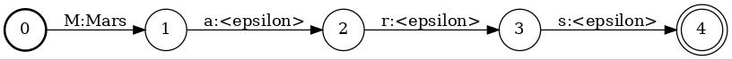

```
fstcompile --isymbols=ascii.syms --osymbols=wotw.syms >Martian.fst <<EOF
0 1 M Martian
1 2 a <epsilon>
2 3 r <epsilon>
3 4 t <epsilon>
4 5 i <epsilon>
5 6 a <epsilon>
6 7 n <epsilon>
7
EOF
```

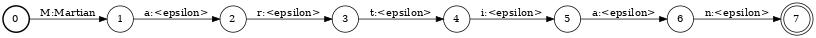

```
fstcompile --isymbols=ascii.syms --osymbols=wotw.syms >man.fst <<EOF
0 1 m man
1 2 a <epsilon>
2 3 n <epsilon>
3
EOF
```

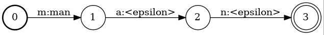

```
fstunion man.fst Mars.fst | fstunion - Martian.fst | fstclosure >lexicon.fst
```

```
fstdraw --isymbols=ascii.syms --osymbols=wotw.syms -portrait lexicon.fst | dot -Tjpg -Gdpi=150 >lexicon.jpg
```

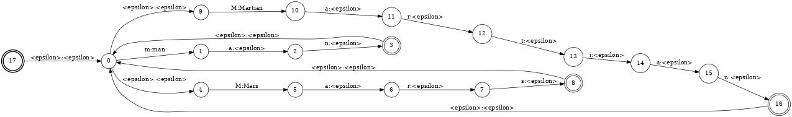

```
fstrmepsilon lexicon.fst | fstdeterminize | fstminimize >lexicon_opt.fst
```

```
fstdraw --isymbols=ascii.syms --osymbols=wotw.syms -portrait lexicon_opt.fst | dot -Tjpg >lexicon_opt.jpg
```

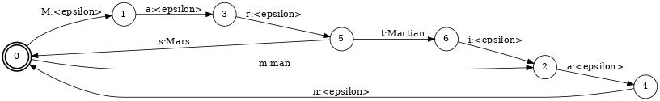

```
fstcompile --isymbols=ascii.syms --osymbols=wotw.syms >punct.fst <<EOF
0 1 <space> <epsilon>
0 1 . <epsilon>
0 1 , <epsilon>
0 1 ? <epsilon>
0 1 ! <epsilon>
1
EOF
```

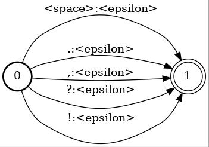

```
fstunion man.fst Mars.fst | fstunion - Martian.fst | fstconcat - punct.fst | fstclosure >lexicon_punc.fst
```

```
fstdraw --isymbols=ascii.syms --osymbols=wotw.syms -portrait lexicon_punc.fst | dot -Tjpg -Gdpi=200>lexicon_punc.jpg
```

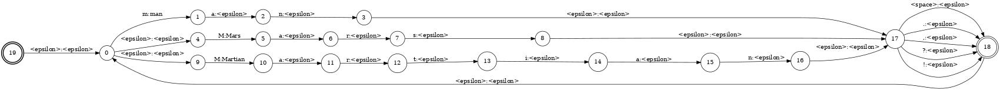

```
fstcompile --isymbols=ascii.syms --osymbols=ascii.syms >Marsman.fst <<EOF
0 1 M M
1 2 a a
2 3 r r
3 4 s s
4 5 <space> <space>
5 6 m m
6 7 a a
7 8 n n
8 9 ! !
9
EOF
```
```
fstdraw --isymbols=ascii.syms --osymbols=ascii.syms -portrait Marsman.fst | dot -Tjpg >Marsman.jpg
```

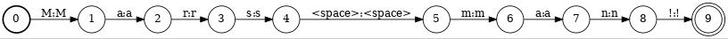

# Exercise 1

(a) Create a transducer that maps numbers in the range 0 - 999999 represented as digit strings to their English read form, e.g.:

```
1 -> one
11 -> eleven
111 -> one hundred eleven
1111 -> one thousand one hundred eleven
11111 -> eleven thousand one hundred eleven
```

for one one game:
```
fstcompile --isymbols=ascii.syms --osymbols=wotw.syms >1.fst <<EOF
0 1 1 one
1
EOF
```

```
fstdraw --isymbols=ascii.syms --osymbols=wotw.syms -portrait 1.fst | dot -Tjpg >1.jpg
```

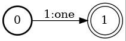

```
fstcompile --isymbols=ascii.syms --osymbols=wotw.syms >11.fst <<EOF
0 1 1 eleven
1 2 1 <epsilon>
2
EOF
```

```
fstdraw --isymbols=ascii.syms --osymbols=wotw.syms -portrait 11.fst | dot -Tjpg >11.jpg
```

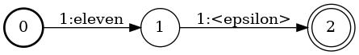

```
fstcompile --isymbols=ascii.syms --osymbols=wotw.syms >111.fst <<EOF
0 1 1 one
1 2 <epsilon> hundred
2 3 <epsilon> eleven
3 4 1 <epsilon>
4 5 1 <epsilon>
5
EOF
```

```
fstdraw --isymbols=ascii.syms --osymbols=wotw.syms -portrait 111.fst | dot -Tjpg >111.jpg
```

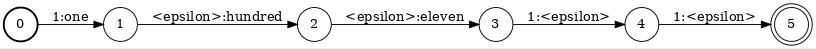


```
fstcompile --isymbols=ascii.syms --osymbols=wotw.syms >1111.fst <<EOF
0 1 1 one
1 2 <epsilon> thousand
2 3 <epsilon> one
3 4 <epsilon> hundred
4 5 <epsilon> eleven
5 6 1 <epsilon>
6 7 1 <epsilon>
7 8 1 <epsilon>
8
EOF
```

```
fstdraw --isymbols=ascii.syms --osymbols=wotw.syms -portrait 1111.fst | dot -Tjpg -Gdpi=150>1111.jpg
```

```
fstcompile --isymbols=ascii.syms --osymbols=wotw.syms >11111.fst <<EOF
0 1 1 eleven
1 2 <epsilon> thousand
2 3 <epsilon> one
3 4 <epsilon> hundred
4 5 <epsilon> eleven
5 6 1 <epsilon>
6 7 1 <epsilon>
7 8 1 <epsilon>
8 9 1 <epsilon>
9
EOF
```

```
fstdraw --isymbols=ascii.syms --osymbols=wotw.syms -portrait 11111.fst | dot -Tjpg -Gdpi=150>11111.jpg
```

```
fstunion 1.fst 11.fst | fstunion - 111.fst | fstunion - 1111.fst | fstunion - 11111.fst | fstconcat - punct.fst | fstclosure > 5m1.fst
```

```
fstdraw --isymbols=ascii.syms --osymbols=wotw.syms -portrait 5m1.fst | dot -Tjpg -Gdpi=300>5m1.jpg
```

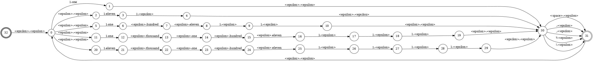


```
fstcompile --isymbols=ascii.syms --osymbols=ascii.syms >input1.fst <<EOF
0 1 1 1
1 2 1 1
2 3 1 1
3 4 1 1
4 5 <space> <space>
5 6 1 1
6 7 1 1
7 8 1 1
8 9 , ,
9 10 1 1
10 11 . .
11
EOF
```

```
fstdraw --isymbols=ascii.syms --osymbols=ascii.syms -portrait input1.fst | dot -Tjpg -Gdpi=150>input1.jpg
```

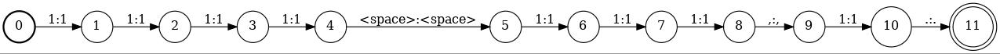

```
fstcompose input1.fst 5m1.fst | fstproject --project_output | fstrmepsilon > out1.fst
```

```
fstdraw --isymbols=wotw.syms --osymbols=wotw.syms -portrait out1.fst | dot -Tjpg -Gdpi=150>out1.jpg
```

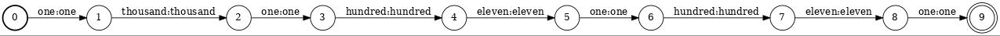


for range 0 - 999999 :

add to wotw.syms

```
seventeen   7103
eighteen    7104
nineteen    7105
sixty   7106
seventy 7107
eighty  7108
```

```
fstcompile --isymbols=ascii.syms --osymbols=ascii.syms > is_digit.fst << EOF
0 1 1 1
0 1 2 2
0 1 3 3
0 1 4 4
0 1 5 5
0 1 6 6
0 1 7 7
0 1 8 8
0 1 9 9
0 1 0 0
1
EOF
```

```
fstdraw --isymbols=ascii.syms --osymbols=ascii.syms -portrait is_digit.fst | dot -Tjpg >is_digit.jpg
```

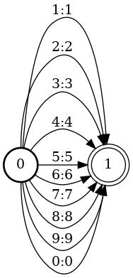

```
fstcompile --isymbols=ascii.syms --osymbols=wotw.syms > name0.fst << EOF
0 1 1 one
0 1 2 two
0 1 3 three
0 1 4 four
0 1 5 five
0 1 6 six
0 1 7 seven
0 1 8 eight
0 1 9 nine
1
EOF
```

```
fstdraw --isymbols=ascii.syms --osymbols=wotw.syms -portrait name0.fst | dot -Tjpg >name0.jpg
```

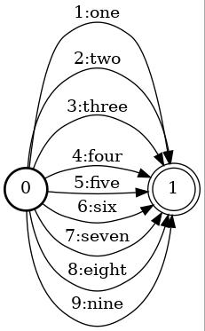

test 1 digit(<10):
```
fstcompile --isymbols=ascii.syms --osymbols=ascii.syms > test7.fst <<EOF
0 1 7 7
1
EOF
```

```
fstdraw --isymbols=ascii.syms --osymbols=ascii.syms -portrait test7.fst | dot -Tjpg >test7.jpg
```

```
fstcompose test7.fst name0.fst | fstproject --project_output | fstrmepsilon > test7_out.fst
```

```
fstdraw --isymbols=wotw.syms --osymbols=wotw.syms -portrait test7_out.fst | dot -Tjpg >test7_out.jpg
```

for 2 digit(10<=,<20):
```
fstcompile --isymbols=ascii.syms --osymbols=wotw.syms > name1.fst << EOF
0 1 1 <epsilon>
1 2 0 ten
1 2 1 eleven
1 2 2 twelve
1 2 3 thirteen
1 2 4 fourteen
1 2 5 fifteen
1 2 6 sixteen
1 2 7 seventeen
1 2 8 eighteen
1 2 9 nineteen
2
EOF
```

```
fstdraw --isymbols=ascii.syms --osymbols=wotw.syms -portrait name1.fst | dot -Tjpg >name1.jpg
```

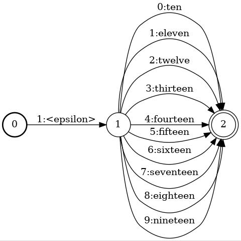

try 2 digit(10<=,>20):

```
fstcompile --isymbols=ascii.syms --osymbols=ascii.syms > test15.fst << EOF
0 1 1 1
1 2 5 5
2
EOF
```

```
fstdraw --isymbols=ascii.syms --osymbols=ascii.syms -portrait test15.fst | dot -Tjpg >test15.jpg
```

```
fstcompose test15.fst name1.fst | fstproject --project_output | fstrmepsilon > test15_out.fst
```

```
fstdraw --isymbols=wotw.syms --osymbols=wotw.syms -portrait test15_out.fst | dot -Tjpg >test15_out.jpg
```

for 2 digit(>20):

```
fstcompile --isymbols=ascii.syms --osymbols=wotw.syms > name2pre.fst << EOF
0 1 2 twenty
0 1 3 thirty
0 1 4 forty
0 1 5 fifty
0 1 6 sixty
0 1 7 seventy
0 1 8 eighty
0 1 9 ninety
1
EOF
```

```
fstdraw --isymbols=ascii.syms --osymbols=wotw.syms -portrait name2pre.fst | dot -Tjpg >name2pre.jpg
```

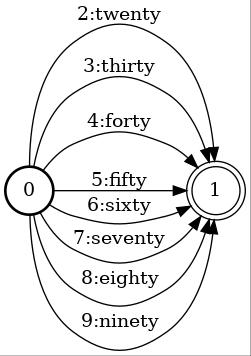

```
fstconcat name2pre.fst name0.fst > name2.fst
```

```
fstdraw --isymbols=ascii.syms --osymbols=wotw.syms -portrait name2.fst | dot -Tjpg >name2.jpg
```

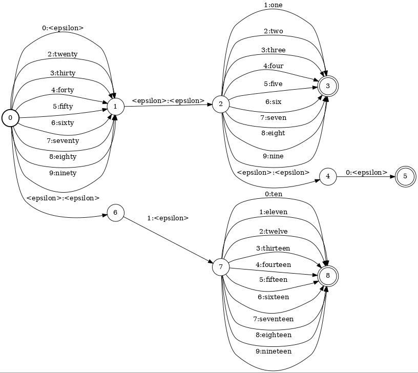

```
fstrmepsilon name2.fst | fstdeterminize | fstminimize >name2_opt.fst
```

```
fstdraw --isymbols=ascii.syms --osymbols=wotw.syms -portrait name2_opt.fst | dot -Tjpg >name2_opt.jpg
```

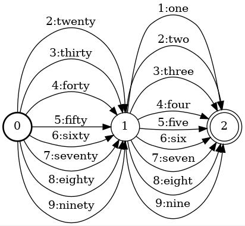

testing 2 digit:

```
fstcompile --isymbols=ascii.syms --osymbols=ascii.syms > test35.fst <<EOF
0 1 3 3
1 2 5 5
2
EOF
```

```
fstdraw --isymbols=ascii.syms --osymbols=ascii.syms -portrait test35.fst | dot -Tjpg >test35.jpg
```

```
fstcompose test35.fst name2_opt.fst | fstproject --project_output | fstrmepsilon > test35_out.fst
```

```
fstdraw --isymbols=wotw.syms --osymbols=wotw.syms -portrait test35_out.fst | dot -Tjpg >test35_out.jpg
```

for 3 digit:

```
fstcompile --isymbols=ascii.syms --osymbols=wotw.syms > hundred.fst << EOF
0 1 <epsilon> hundred
1
EOF
```

```
fstdraw --isymbols=ascii.syms --osymbols=wotw.syms -portrait hundred.fst | dot -Tjpg >hundred.jpg
```

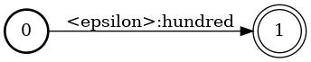

```
fstconcat name0.fst hundred.fst | fstconcat - name2.fst > name3.fst
```

```
fstdraw --isymbols=ascii.syms --osymbols=wotw.syms -portrait name3.fst | dot -Tjpg -Gdip=300>name3.jpg
```

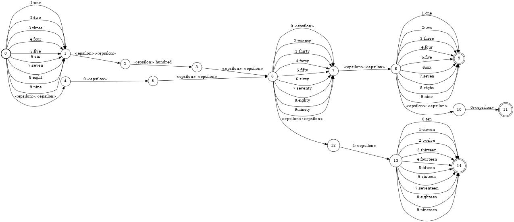

```
fstrmepsilon name3.fst | fstdeterminize | fstminimize >name3_opt.fst
```

```
fstdraw --isymbols=ascii.syms --osymbols=wotw.syms -portrait name3_opt.fst | dot -Tjpg -Gdip=300>name3_opt.jpg
```

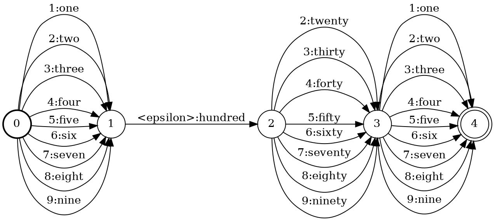

testing 3 digit:

```
fstcompile --isymbols=ascii.syms --osymbols=ascii.syms > test234.fst << EOF
0 1 2 2
1 2 3 3
2 3 4 4
3
EOF
```

```
fstcompose test234.fst name3_opt.fst | fstproject --project_output | fstrmepsilon > test234_out.fst
```

```
fstdraw --isymbols=wotw.syms --osymbols=wotw.syms -portrait test234_out.fst | dot -Tjpg >test234_out.jpg
```

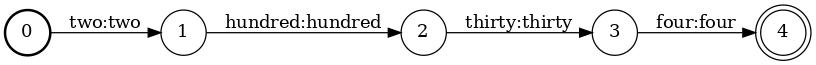